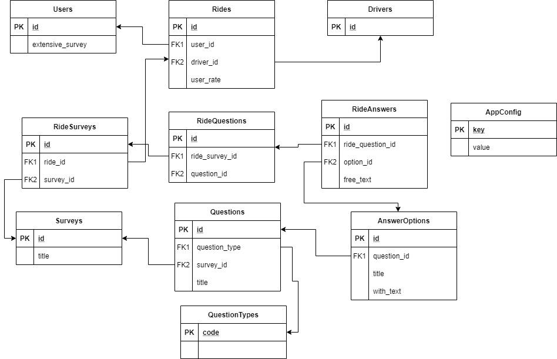

# Full-Stack Software Engineer Challenge

## Requirements

* Python >3.8
* Postgres >9

## Data model



### Entities

* Users - list of users
  * extensive_survey - true if user is included in extensive_survey program.
* Drivers - list of drives
* Rides - rides made by drive and user.
  * user_rate - rating for the ride given by user during survey.
* Surveys - list of surveys
* Questions - list of questions per each Surveys.
* AnswerOptions - list of optional answers for a question.
  * with_text - boolean field. if AnserOption allows free text.
* QuestionTypes - type of questions. can be: **multi**, **single**, **freetext**
* RideSurveys - list of answered surveys for ride.
* RideQuestions - list of answered question for RideSurveys entity.
* RideAnswers - list of answers for Question.
* AppConfig - Settings for application. Contains current survey_id used by default for survey if survey_id is not define explicitly.

## Endpoints

### / GET

Return webpage with rendered survey.

#### Query string arguments

* ride_id - the id of the ride, where we want to take survey about. Mandatory.
* survey_id - id of specific survey. If survey_id is not provided, we use **current_survey_id** value from **AppConfig** table.

#### Examples

* /?ride_id=1 - Show default (defined in AppConfig) survey regarding ride 1.
* /?ride_id=1&survey_id=1 - Show survey 1 for ride 1.

### /api/survey GET

Returns survey data in json format.

#### Query string arguments

* ride_id - the id of the ride, where we want to take survey about. Mandatory.
* survey_id - id of specific survey. If survey_id is not provided, we use **current_survey_id** value from **AppConfig** table.

#### Examples

* /api/survey?ride_id=1 - Show default (defined in AppConfig) survey regarding ride 1.
* /api/survey?ride_id=1&survey_id=1 - Show survey 1 for ride 1.

### /api/survey POST

Save survey answers.

#### Body Example

```
{
  "id": 1,
  "ride_id": 1,
  "user_rate": 2,
  "questions": [
    {"id": 3, "answers": [{"id": 4, "free_text": "TXT"}],}
  ],
}
 ```
 
 ### /api/reset-db GET
 
 Reset DB and load sample data.
 
 ## Sample Data
 
 Sample data is defined in [sample_data.sql](app/sample_data.sql)
 
 ## Environment variables
 
 ### DB_URL
 
 Connection string to DB.
 
 Example: postgres://localhost/moro
 
 ### TEST_DB_URL
 
 Connection string to test DB.
 
 Example: postgres://localhost/moro_test
 

## Run

```
FLASK_APP=app.main:app FLASK_ENV=development flask run -p 8080 > /tmp/moro-app.log 2>&1
```
